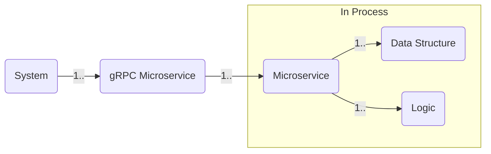
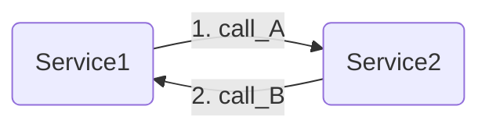
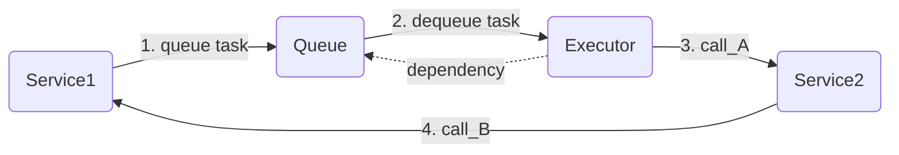
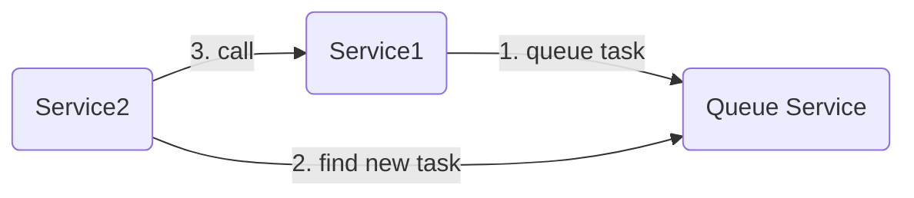

# microservice-pattern

## Concept

This crate advocates the use of **in-process microservice pattern**.

The typical modern system is consist of bunch of gRPC micro services that communicates each other. The gRPC microservice is a process whose internal is consist of logics and data structures. 

To develop the internal, in-process microservices is a very helping layer because you can modularize the internal in the same way the gRPC services does in the inter-process layer.

## Ticking

A processing of in-process micro services is triggered by either
gRPC request or internal tick.

To make a internal tick you can use tools in tokio::time or 
[tokio-cron-scheduler](https://github.com/mvniekerk/tokio-cron-scheduler)
for more flexible control of the ticks.

## Dependency loop

Dependency loops are not allowed in this library because it is a vicious way of designing micro services but it is sometimes inevitable. To work around, queue can be used to invert the dependency. You may use actor framework to implement this.

==

This is quite similar to sidecar pattern.

